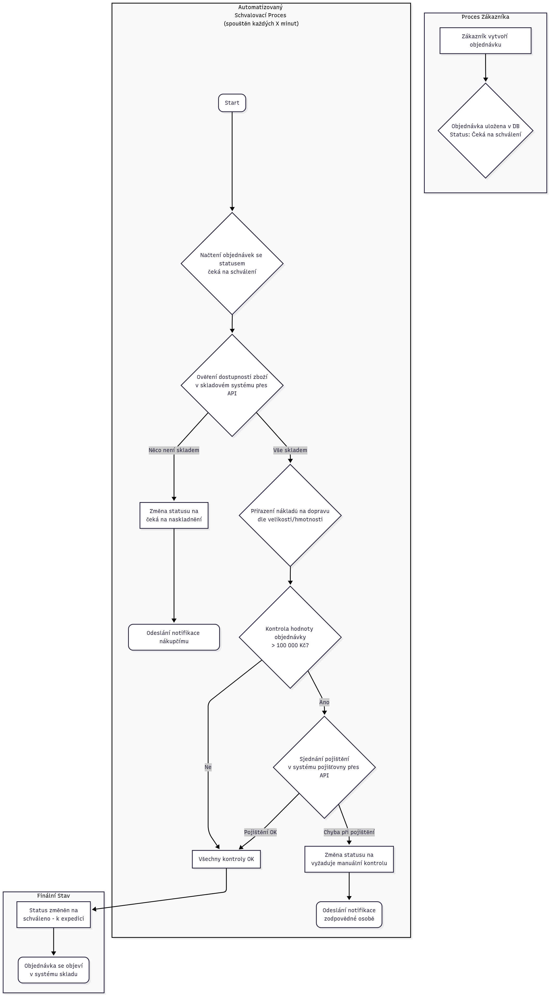

# Cross Master - Analýza predajov a automatizácia objednávok

Tento projekt obsahuje sadu Python skriptov pre analýzu predajných dát a automatizáciu spracovania objednávok pre fiktívny e-shop "Cross Master".

## Architektúra a štruktúra projektu

### Diagram architektúry



### Popis priečinkov

-   `src/`: Obsahuje hlavné spustiteľné skripty.
    -   `analysis.py`: Načíta dáta o transakciách a produktoch, vykoná analýzu a vypíše výsledky do konzoly.
    -   `order_automation.py`: Simuluje proces spracovania nových objednávok, kontroluje dostupnosť tovaru a na základe výsledkov mení stav objednávok.
-   `data/`: Obsahuje vstupné a výstupné dáta.
    -   `in/`: Vstupné CSV súbory (`Products.csv`, `Transactions.csv`).
    -   `out/`: Priečinok pre exportované súbory (napr. `output.csv` z automatizačného skriptu).
-   `tests/`: Obsahuje automatizované testy.
    -   `test_order_automation.py`: Testy pre skript `order_automation.py` využívajúce `unittest`.
-   `requirements.txt`: Zoznam potrebných Python knižníc.

## Inštalácia

1.  Naklonujte si repozitár.
2.  Odporúča sa vytvoriť virtuálne prostredie:
    ```bash
    python -m venv venv
    source venv/bin/activate  # Na Windows použite `venv\Scripts\activate`
    ```
3.  Nainštalujte potrebné závislosti:
    ```bash
    pip install -r requirements.txt
    ```

## Ako spustiť skripty

Uistite sa, že sa nachádzate v koreňovom priečinku projektu (`Cross Master`).

### Spustenie dátovej analýzy

```bash
python src/analysis.py
```
Skript vypíše kompletnú analýzu priamo do terminálu.

### Spustenie automatizácie objednávok

```bash
python src/order_automation.py
```
Skript spracuje objednávky a uloží výsledný stav do súboru `data/out/output.csv`. Zároveň vypisuje logy o priebehu spracovania do terminálu.

### Spustenie testov

```bash
python -m unittest tests/test_order_automation.py
```
Tento príkaz spustí testy a vypíše výsledky.

## Poznámka

Veľmi príjemná a praktická úloha – robil som niečo veľmi podobné počas môjho prvého internshipu v spoločnosti **PV STEEL**, kde som vyvíjal interný nástroj na automatizované spracovanie objednávok a kontrolu dodávateľských dát.

Oceňujem prepojenie analytiky, biznis logiky a dátového inžinierstva v tomto zadání.
